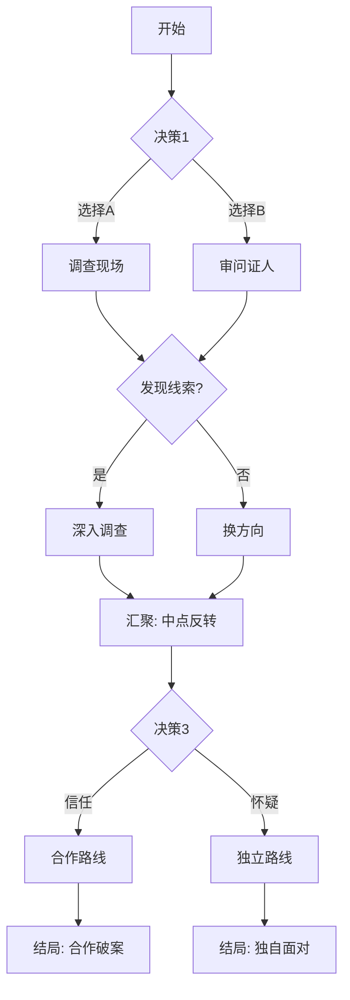

# 分支架构设计

> 互动叙事的拓扑学：如何设计分支结构使故事既有自由度又可控
> 参考 Emily Short 互动叙事理论、Choice of Games 设计指南、ink 叙事设计模式

---

## 一、五种基础拓扑模型

### 1. 瓶颈型（Bottleneck / Funnel）

```
    ┌─ A1 ─┐
S ──┤      ├── M ──┬─ B1 ──┬── E1
    └─ A2 ─┘      ├─ B2 ──┤
                   └─ B3 ──┴── E2

S = 起点, M = 汇聚点, E = 结局
```

**特征**：
- 分支后定期汇聚到"关键节点"
- 分支影响角色状态/关系而非主线走向
- 最终结局由累积的状态决定

**优势**：
- 创作成本可控（内容量 ≈ 线性 × 1.5-2）
- 每条路线都能体验核心剧情
- 状态累积给予选择长期意义

**劣势**：
- 分支的差异可能感觉不够大
- 玩家可能感知到"最终殊途同归"

**适合**：首次互动化、中等复杂度、商业化产品

**设计要点**：
- 汇聚点的场景需要兼容所有来源路径
- 用状态变量记录分支选择的影响
- 汇聚点本身应是有意义的叙事节点（不只是技术连接）

---

### 2. 平行调查型（Parallel Investigation）

```
         ┌── 线索链 A ──┐
         │               │
S ── 分配 ┼── 线索链 B ──┼── 汇总 ── 推理 ── E1/E2/E3
         │               │
         └── 线索链 C ──┘
```

**特征**：
- 读者选择调查哪条线索链
- 每条链提供不同的信息碎片
- 汇总时，持有的信息决定推理质量和结局

**优势**：
- 天然适合推理类型
- 每次游玩获得不同信息 → 高重玩价值
- 选择有明确的实际意义

**劣势**：
- 需要精心设计信息分布，确保每条路线都有足够内容
- 读者可能错过关键信息导致挫败感

**适合**：侦探推理、调查记者、考古探险

**设计要点**：
- 确保"最少调查"路线也能到达至少一个可接受的结局
- 重要信息不要只出现在一条线索链中
- 调查顺序应该影响体验但不影响可达性

---

### 3. 时间循环型（Time Loop）

```
S ── 第1次循环 ──→ 失败 ──┐
     ↑                      │
     └── 带着信息重来 ←──┘

S ── 第2次循环（携带信息）──→ 失败 ──┐
     ↑                                │
     └── 带着更多信息重来 ←────────┘

S ── 第N次循环 ──→ 成功（E1）
```

**特征**：
- 同一核心事件反复经历
- 每次循环读者可以做出不同选择
- 前次循环的发现影响后续选择

**优势**：
- 极高的内容复用率
- 自然的难度递进
- 读者有成长感

**劣势**：
- 重复内容需要精心处理避免无聊
- 需要清晰的"循环退出条件"

**适合**：密室、"什么杀了我"、悬疑解谜

---

### 4. 信任网络型（Trust Network）

```
          信任 A ──→ 获取 A 的信息
         /
S ── 选择信任谁
         \
          信任 B ──→ 获取 B 的信息

每次信任选择改变关系网络 → 最终同盟决定结局
```

**特征**：
- 核心选择是"信任谁/怀疑谁"
- 每个角色提供的信息受信任程度影响
- 同盟关系网络决定最终走向

**优势**：
- 角色驱动，情感投入高
- 每次游玩的社交体验不同
- 自然的"叛变"和"反转"节点

**劣势**：
- 角色 AI/逻辑设计复杂
- 需要大量角色相关的变体文本

**适合**：社会派推理、"狼人杀"式悬疑、封闭空间多人

---

### 5. 自由探索型（Open Investigation）

```
    ┌── 房间 A ──┐
    ├── 房间 B ──┤
S ──┼── 房间 C ──┼──→ 收集足够信息？──→ 推理阶段 ──→ E
    ├── 房间 D ──┤         │
    └── 房间 E ──┘         ↓ 否
                      继续探索
```

**特征**：
- 场景/线索节点自由访问
- 没有强制顺序
- 达到信息阈值后触发推理/结局阶段

**优势**：
- 最高自由度
- 最接近真实推理体验
- 非线性探索满足好奇心

**劣势**：
- 缺乏叙事推动力
- 读者可能迷失
- 需要大量独立可访问的内容

**适合**：密室逃脱、现场勘查、点击解谜

---

## 二、混合拓扑设计

### 推荐组合

| 组合 | 描述 | 适用场景 |
|------|------|---------|
| 瓶颈 + 平行调查 | 主线瓶颈推进，调查阶段自由探索 | 通用推理 |
| 信任网络 + 瓶颈 | 社交选择影响状态，关键节点汇聚 | 社会派 |
| 时间循环 + 自由探索 | 每次循环自由探索不同区域 | 密室 |
| 平行调查 + 信任网络 | 调查线索时选择合作对象 | 团队推理 |

---

## 三、分支统计与管理

### 复杂度控制公式

```
总内容量 ≈ 线性文本量 × 分支系数

分支系数参考：
  瓶颈型：1.5 - 2.0
  平行调查型：2.0 - 3.0
  时间循环型：1.3 - 1.8（高复用）
  信任网络型：2.5 - 4.0
  自由探索型：3.0 - 5.0

决策点数量指南：
  轻量体验（30分钟）：3-5 个决策点
  标准体验（1-2小时）：8-12 个决策点
  深度体验（3+小时）：15-25 个决策点
```

### 分支可达性检查

```
对每个节点回答：
  □ 这个节点至少有一条路径可达
  □ 从这个节点出发至少可以到达一个结局
  □ 不存在无限循环（除非是有意的时间循环设计）
  □ 到达此节点的所有路径都提供了理解此节点内容所需的信息
```

---

## 四、汇聚节点设计

### 汇聚节点的三层写法

```
Layer 1：核心文本
  所有路径共享的叙事内容
  不引用任何分支特有的事件

Layer 2：条件文本
  根据状态变量插入的差异段落
  if (trust_A > 60): "A 向你走来，眼中带着信任。"
  else: "A 站在远处，保持着距离。"

Layer 3：回顾整合
  简短地呼应读者的选择历史
  "你想起了那天在仓库的决定。"
  （具体内容根据分支不同而变化）
```

### 汇聚点的叙事功能

汇聚点不应只是技术上的"合并节点"，它应该是：
- 一个重要的剧情转折点
- 一个需要所有人"在场"的事件
- 一个不管前面怎么走都要面对的挑战

### 完整汇聚节点示例

背景：读者在之前选择了"去仓库调查"或"审讯证人"，现在汇聚到"团队会议"。

```yaml
---
id: n025
title: 团队会议
type: convergence
from: [n020_warehouse, n021_interrogation]
reads: [found_knife, trust_chen, warehouse_visited, witness_statement]
writes: [team_aligned, next_lead]
---
```

```
## Layer 1: 核心文本（所有路径共享）

会议室的白板上贴满了照片和时间线。窗外天已经黑了。

"好，"林探长把一杯凉了的咖啡放在桌上，"说说我们有什么。"

王法医翻开文件夹。"死因确认是窒息，但有一个异常——"
他停顿了一下，"气管内有微量化学残留。不是常见的。"

## Layer 2: 条件文本（根据来源路径不同）

{if warehouse_visited}:
你想起仓库角落那排化学品储物柜。标签已经模糊了，
但你拍了照片。你把手机递给王法医："这些化学品，
和你说的残留物有没有关系？"
他接过手机，眉头越拧越紧。"有三种吻合。"

{if NOT warehouse_visited AND witness_statement}:
"证人说受害者生前一直咳嗽，"你翻开笔记本。
"持续了至少两周。她以为是感冒。"
王法医缓缓点头。"这和化学残留的慢性接触是一致的。
问题是——接触源在哪里？"

## Layer 3: 回顾整合（呼应选择历史）

{if found_knife}:
你还没有提那把刀的事。在所有人面前说出来之前，
你需要先确认它和化学残留有没有关联。

{if trust_chen >= 60}:
会议结束后，陈医生主动留了下来。
"林探长，有件事我一直在犹豫要不要告诉你——"
→ 解锁 n030_chen_confession

{if trust_chen < 60}:
散会的时候，你注意到陈医生走得很快。
→ 只能走 n031_investigate_chen

## 选择

> **追查化学品来源**
> → n028 (next_lead = "chemical_source")

> **重新检查受害者的工作环境**
> → n029 (next_lead = "workplace")
```

**设计要点解析**：
- Layer 1 推进了新信息（化学残留），所有路径都获得这个信息
- Layer 2 根据来源路径决定信息"怎么被发现"——仓库路线直接关联，证人路线间接推导
- Layer 3 根据累积状态解锁不同后续——高信任触发角色告白，低信任只能继续调查
- 两条路线的读者在此节点后信息量相当，但获取方式不同 → 体验不同但公平

---

## 五、分支可视化

### Mermaid 模板


