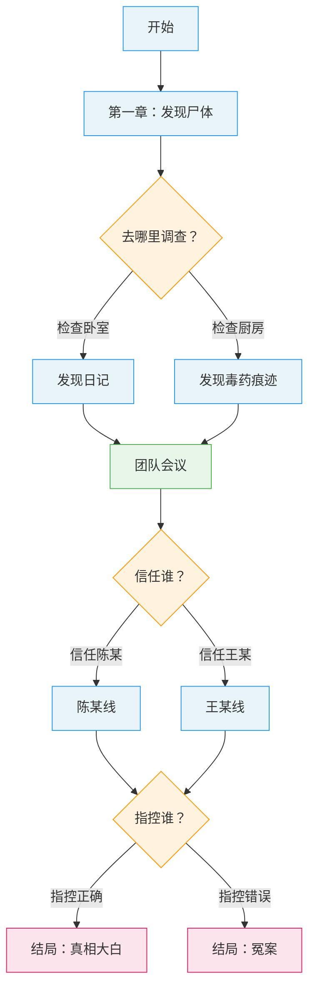

# 导出格式规范

> 从节点系统到可运行互动小说的具体语法映射
> 覆盖 Twine (Harlowe/SugarCube)、ink、ChoiceScript、JSON Schema

---

## 一、通用节点到平台的映射概念

### 节点类型与平台概念对照

| 节点类型 | Twine (Harlowe) | Twine (SugarCube) | ink | ChoiceScript |
|----------|-----------------|-------------------|-----|-------------|
| 叙事节点 | Passage | Passage | Knot | Scene段落 |
| 决策节点 | Passage+Links | Passage+Links | Knot+Choices | *choice块 |
| 汇聚节点 | Passage+If | Passage+If | Knot+Conditional | Scene+*if |
| 结局节点 | Passage(tag:ending) | Passage(tag:ending) | Knot→END | *ending |
| 状态变更 | (set:) | <<set>> | ~ var = val | *set |

---

## 二、Twine 导出

### Harlowe 3 格式

**变量声明**（在第一个 passage 中）：
```
(set: $trust_detective to 50)
(set: $evidence_count to 0)
(set: $found_knife to false)
(set: $clues to (a:))
```

**叙事节点**：
```
:: 第一章：发现
你推开公寓的门。空气中弥漫着一股不对劲的气味——
甜腻的、化学的，像是什么东西在腐烂。

客厅的灯开着。茶几上有两杯凉透的咖啡。

[[检查卧室->检查卧室]]
[[检查厨房->检查厨房]]
```

**决策节点（带状态变更）**：
```
:: 审讯陈某
"陈先生，案发当晚你在哪里？"

他的手指在桌面上轻轻敲了两下。

(link-reveal: "直接施压")[
  "监控显示你九点钟出现在大楼附近。解释一下。"
  他的脸色变了。
  (set: $trust_chen to it - 20)
  (set: $chen_pressured to true)
  [[继续审讯->审讯陈某-施压后]]
]

(link-reveal: "迂回试探")[
  "聊聊你和受害者的关系吧。普通朋友？"
  他放松了一些。"对，就是普通朋友。"
  (set: $trust_chen to it + 10)
  [[继续审讯->审讯陈某-试探后]]
]
```

**汇聚节点（条件文本）**：
```
:: 团队会议
所有人围坐在会议室里。

(if: $found_knife)[你把在地下室发现的匕首照片投到屏幕上。]
(else:)[你展示了目前收集到的证物照片。]

(if: $trust_chen > 60)[
  陈某主动站了起来。"我有件事需要告诉大家。"
](else:)[
  陈某坐在角落里，一言不发。
]

[[听取各方汇报->汇报阶段]]
```

**结局节点**：
```
:: 结局：真相大白 {"position":"600,800","tags":"ending"}
(if: $evidence_count >= 7)[
  你把所有证据摊在桌上。每一条线索都指向同一个人。
  "凶手就是——"
](else:)[
  你还差最后一块拼图。但时间不等人。
  "根据现有证据，我认为——"
]

{真相揭示正文}

**THE END**

(link: "重新开始")[(goto: "开始")]
```

### SugarCube 2 格式

**变量声明**（StoryInit passage）：
```
:: StoryInit
<<set $trust_detective to 50>>
<<set $evidence_count to 0>>
<<set $found_knife to false>>
<<set $clues to []>>
```

**决策节点**：
```
:: 审讯陈某
"陈先生，案发当晚你在哪里？"

他的手指在桌面上轻轻敲了两下。

<<link "直接施压">>
  <<set $trust_chen to $trust_chen - 20>>
  <<set $chen_pressured to true>>
  <<goto "审讯陈某-施压后">>
<</link>>

<<link "迂回试探">>
  <<set $trust_chen to $trust_chen + 10>>
  <<goto "审讯陈某-试探后">>
<</link>>
```

**条件文本**：
```
<<if $found_knife>>
  你把在地下室发现的匕首照片投到屏幕上。
<<else>>
  你展示了目前收集到的证物照片。
<</if>>
```

---

## 三、ink 导出

### 基本概念映射

```
节点 → Knot（=== knot_name ===）
子节点 → Stitch（= stitch_name）
选择 → Choice（+ / *）
状态变量 → VAR / ~ 赋值
条件文本 → { condition: text }
跳转 → Divert（-> knot_name）
```

### 变量声明（文件顶部）：
```ink
VAR trust_detective = 50
VAR evidence_count = 0
VAR found_knife = false
VAR chen_pressured = false
LIST clues = knife, letter, photo, fingerprint
```

### 叙事节点：
```ink
=== chapter_1_discovery ===
你推开公寓的门。空气中弥漫着一股不对劲的气味——甜腻的、化学的，像是什么东西在腐烂。

客厅的灯开着。茶几上有两杯凉透的咖啡。

+ [检查卧室] -> check_bedroom
+ [检查厨房] -> check_kitchen
```

### 决策节点（带状态变更）：
```ink
=== interrogate_chen ===
"陈先生，案发当晚你在哪里？"

他的手指在桌面上轻轻敲了两下。

+ [直接施压]
    "监控显示你九点钟出现在大楼附近。解释一下。"
    他的脸色变了。
    ~ trust_chen -= 20
    ~ chen_pressured = true
    -> interrogate_chen_after_pressure

+ [迂回试探]
    "聊聊你和受害者的关系吧。普通朋友？"
    他放松了一些。"对，就是普通朋友。"
    ~ trust_chen += 10
    -> interrogate_chen_after_probe
```

### 汇聚节点（条件文本）：
```ink
=== team_meeting ===
所有人围坐在会议室里。

{ found_knife:
    你把在地下室发现的匕首照片投到屏幕上。
- else:
    你展示了目前收集到的证物照片。
}

{ trust_chen > 60:
    陈某主动站了起来。"我有件事需要告诉大家。"
- else:
    陈某坐在角落里，一言不发。
}

-> report_phase
```

### 结局节点：
```ink
=== ending_truth ===
{ evidence_count >= 7:
    你把所有证据摊在桌上。每一条线索都指向同一个人。
- else:
    你还差最后一块拼图。但时间不等人。
}

{真相揭示正文}

-> END
```

### ink 特有功能：
```ink
// 线程（并行内容）— 适合同时展示多条线索
=== investigation ===
<- clue_a_thread
<- clue_b_thread
-> DONE

// 隧道（临时跳转后返回）— 适合插入回忆/闪回
=== main_story ===
在审讯中途，你想起了一件事。
-> flashback ->
回到现实。你知道该怎么做了。

// 函数 — 适合计算推理评分
=== function calculate_score() ===
~ temp score = 0
{ found_knife: ~ score += 2 }
{ found_letter: ~ score += 1 }
{ trust_chen > 50: ~ score += 1 }
~ return score
```

---

## 四、ChoiceScript 导出

### 文件结构

```
game/
├── startup.txt      (变量声明 + 第一个场景)
├── choicescript_stats.txt  (状态面板)
├── chapter1.txt     (场景文件)
├── chapter2.txt
├── interrogation.txt
└── endings.txt
```

### startup.txt：
```choicescript
*title 迷局
*author [作者名]

*create trust_detective 50
*create evidence_count 0
*create found_knife false
*create chen_pressured false

*scene_list
  chapter1
  chapter2
  interrogation
  endings

*goto_scene chapter1
```

### choicescript_stats.txt（状态面板）：
```choicescript
*stat_chart
  text clue_status 线索状态
  percent trust_detective 探长信任度
  opposed_pair evidence_count
    证据充分
    证据不足
```

### 决策节点：
```choicescript
"陈先生，案发当晚你在哪里？"

他的手指在桌面上轻轻敲了两下。

*choice
  #直接施压
    "监控显示你九点钟出现在大楼附近。解释一下。"
    他的脸色变了。
    *set trust_chen -20
    *set chen_pressured true
    *goto after_pressure
  #迂回试探
    "聊聊你和受害者的关系吧。普通朋友？"
    他放松了一些。"对，就是普通朋友。"
    *set trust_chen +10
    *goto after_probe

*label after_pressure
{施压后的内容}
*goto team_meeting

*label after_probe
{试探后的内容}
*goto team_meeting
```

### 条件文本：
```choicescript
*label team_meeting
所有人围坐在会议室里。

*if found_knife
  你把在地下室发现的匕首照片投到屏幕上。
*else
  你展示了目前收集到的证物照片。

*if (trust_chen > 60)
  陈某主动站了起来。"我有件事需要告诉大家。"
*else
  陈某坐在角落里，一言不发。
```

### 结局：
```choicescript
*label ending_truth
*if (evidence_count >= 7)
  你把所有证据摊在桌上。
*else
  你还差最后一块拼图。

{真相揭示正文}

*ending
```

---

## 五、JSON Schema 导出

```json
{
  "$schema": "https://json-schema.org/draft/2020-12/schema",
  "title": "InteractiveFiction",
  "type": "object",
  "properties": {
    "metadata": {
      "type": "object",
      "properties": {
        "title": { "type": "string" },
        "author": { "type": "string" },
        "version": { "type": "string" },
        "created": { "type": "string", "format": "date" },
        "topology": { "enum": ["bottleneck", "parallel", "timeloop", "trust_network", "open"] }
      }
    },
    "variables": {
      "type": "array",
      "items": {
        "type": "object",
        "properties": {
          "name": { "type": "string" },
          "type": { "enum": ["boolean", "integer", "range", "enum", "set"] },
          "initial": {},
          "min": { "type": "number" },
          "max": { "type": "number" },
          "visible": { "type": "boolean" }
        }
      }
    },
    "nodes": {
      "type": "array",
      "items": {
        "type": "object",
        "properties": {
          "id": { "type": "string" },
          "title": { "type": "string" },
          "type": { "enum": ["narrative", "decision", "convergence", "ending"] },
          "content": { "type": "string" },
          "conditions": {
            "type": "array",
            "items": {
              "type": "object",
              "properties": {
                "variable": { "type": "string" },
                "operator": { "enum": ["==", "!=", ">", "<", ">=", "<=", "contains"] },
                "value": {}
              }
            }
          },
          "state_changes": {
            "type": "array",
            "items": {
              "type": "object",
              "properties": {
                "variable": { "type": "string" },
                "operation": { "enum": ["set", "add", "subtract", "toggle", "append"] },
                "value": {}
              }
            }
          },
          "choices": {
            "type": "array",
            "items": {
              "type": "object",
              "properties": {
                "text": { "type": "string" },
                "target": { "type": "string" },
                "conditions": { "type": "array" },
                "state_changes": { "type": "array" }
              }
            }
          },
          "conditional_text": {
            "type": "array",
            "items": {
              "type": "object",
              "properties": {
                "condition": { "type": "object" },
                "text": { "type": "string" },
                "else_text": { "type": "string" }
              }
            }
          }
        },
        "required": ["id", "type", "content"]
      }
    },
    "endings": {
      "type": "array",
      "items": {
        "type": "object",
        "properties": {
          "id": { "type": "string" },
          "name": { "type": "string" },
          "grade": { "enum": ["S", "A", "B", "C"] },
          "trigger_conditions": { "type": "array" }
        }
      }
    }
  }
}
```

---

## 六、Mermaid 流程图导出

### 模板



### 节点标注规范

```
节点命名：{类型缩写}{编号}_{简述}
  N01_discovery    叙事节点
  D01_investigate  决策节点
  M01_meeting      汇聚节点
  E01_truth        结局节点

边标注：选项文案或条件
颜色编码：蓝=叙事，橙=决策，绿=汇聚，粉=结局
```
